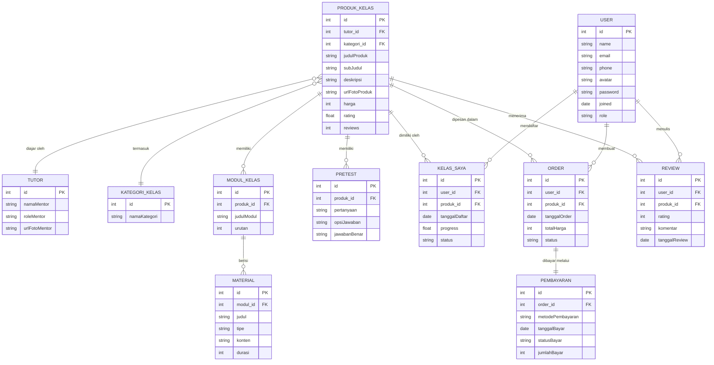

```mermaid
erDiagram
    USER {
        int id PK
        string name
        string email
        string phone
        string avatar
        string password
        date joined
        string role
    }

    TUTOR {
        int id PK
        string namaMentor
        string roleMentor
        string urlFotoMentor
    }

    KATEGORI_KELAS {
        int id PK
        string namaKategori
    }

    PRODUK_KELAS {
        int id PK
        int tutor_id FK
        int kategori_id FK
        string judulProduk
        string subJudul
        string deskripsi
        string urlFotoProduk
        int harga
        float rating
        int reviews
    }

    MODUL_KELAS {
        int id PK
        int produk_id FK
        string judulModul
        int urutan
    }

    MATERIAL {
        int id PK
        int modul_id FK
        string judul
        string tipe
        string konten
        int durasi
    }

    PRETEST {
        int id PK
        int produk_id FK
        string pertanyaan
        string opsiJawaban
        string jawabanBenar
    }

    KELAS_SAYA {
        int id PK
        int user_id FK
        int produk_id FK
        date tanggalDaftar
        float progress
        string status
    }

    ORDER {
        int id PK
        int user_id FK
        int produk_id FK
        date tanggalOrder
        int totalHarga
        string status
    }

    PEMBAYARAN {
        int id PK
        int order_id FK
        string metodePembayaran
        date tanggalBayar
        string statusBayar
        int jumlahBayar
    }

    REVIEW {
        int id PK
        int user_id FK
        int produk_id FK
        int rating
        string komentar
        date tanggalReview
    }

    USER ||--o{ KELAS_SAYA : "mendaftar"
    USER ||--o{ ORDER : "membuat"
    USER ||--o{ REVIEW : "menulis"

    PRODUK_KELAS ||--o{ KELAS_SAYA : "dimiliki oleh"
    PRODUK_KELAS ||--o{ ORDER : "dipesan dalam"
    PRODUK_KELAS ||--o{ REVIEW : "menerima"
    PRODUK_KELAS ||--o{ MODUL_KELAS : "memiliki"
    PRODUK_KELAS ||--o{ PRETEST : "memiliki"
    PRODUK_KELAS }o--|| TUTOR : "diajar oleh"
    PRODUK_KELAS }o--|| KATEGORI_KELAS : "termasuk"

    MODUL_KELAS ||--o{ MATERIAL : "berisi"

    ORDER ||--|| PEMBAYARAN : "dibayar melalui"
```
